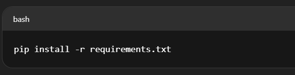
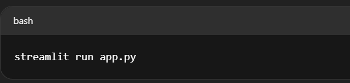
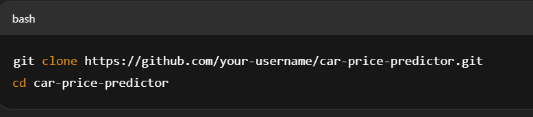
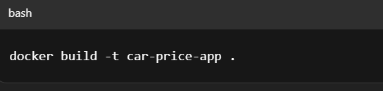
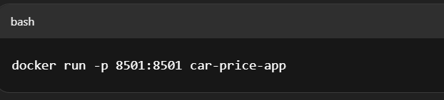

# End-To-End-Machine-Learning-Project-Implementation-With-Dockers-Github-Actions-And-Deployment


https://end-to-end-machine-learning-project-g26h.onrender.com/

# 🚗 Car Price Prediction App

This project is a complete machine learning web application that predicts the price of a car based on user input such as brand, model, year, fuel type, and kilometers driven. The app uses Linear Regression from scikit-learn for real-time predictions and includes a from-scratch implementation of the same algorithm to understand its internal workings.

It also integrates Docker, CI/CD with GitHub Actions, and is deployed on Render, making it both a functional product and a complete learning project.

## 🎯 Why I Built This Project

I didn’t just want to use a machine learning model — I wanted to understand how it actually works.

So apart from building a production-ready model using scikit-learn, I also created a Linear Regression implementation from scratch** using only NumPy.

# 🧠 Project Highlights
🚘 Predicts car resale prices based on user input

📊 Model: Linear Regression using scikit-learn

🧮 Preprocessing with OneHotEncoder and ColumnTransformer

🧪 Evaluation with R² Score across 1000 random splits

🎨 Built with Streamlit for a clean frontend

🐳 Dockerized for portability

🔄 GitHub Actions for CI/CD

🌐 Deployed live on Render

📘 Also includes Linear Regression from scratch implementation and math explanation


# 🛠 Technologies Used

- Python
- scikit-learn
- NumPy
- Pandas
- Streamlit
- Docker
- Git & GitHub
- GitHub Actions (CI/CD)
- Render (Deployment)


# 📁 Project Structure (Simplified)

- app.py – Main Streamlit app for user interaction and prediction

- model.pkl – Trained Linear Regression model using scikit-learn

- requirements.txt – Lists all Python dependencies

- linear_regression_scratch.py – Your own Linear Regression from scratch with math

- Dockerfile – Builds a Docker container for deployment

- python-app.yaml – Configuration for deploying on Render

- .github/workflows/ci.yml – GitHub Actions file for CI/CD automation

## 🚀 How to Run the Project

You can run this project in two ways:

---

### ✅ Option 1: Run Locally

#### Prerequisites:

- Python 3.7 or above
- Git installed
- pip

## Steps:

1. Clone the repository

```bash
git clone https://github.com/Komal-Mandal/End-To-End-Machine-Learning-Project-Implementation-With-Dockers-Github-Actions-And-Deployment

2. Create and activate a virtual environment

c:\Users\Komal\Pictures\Screenshots\Screenshot 2025-06-13 105107.png

3.Install dependencies


4.Run the app


## 🐳 Option 2: Run Using Docker

Step 1: Install Docker Engine

Step 2: Clone the Repository


Step 3: Build the Docker ImageStep 


Step 4: Run the Container



# 📘 Learning Linear Regression from Scratch

This project includes a custom Python file where I implement Linear Regression step-by-step with full mathematical understanding:

✅ Calculating predictions using the linear equation y = mx + c

✅ Defining a cost function (mean squared error)

✅ Implementing gradient descent to minimize error

✅ Weight and bias updates using partial derivatives

✅ Visualizing convergence

This gives a solid foundation for truly understanding how ML models learn instead of just using them.

You’ll find this from-scratch implementation with full explanations in the 
file: https://github.com/Komal-Mandal/ML-/tree/main/MultipleLinearRegression

# ☁️ Deployment & CI/CD

The app is deployed on Render. Every push to the main branch:

Triggers a GitHub Action

Builds the Docker image

Deploys the latest version to the live server

The setup includes:

Dockerfile for environment definition

render.yaml for deployment config

.github/workflows/ci.yml for CI/CD automation


📦 GitHub Repository
Explore the full code and project structure here:
👉https://github.com/Komal-Mandal/End-To-End-Machine-Learning-Project-Implementation-With-Dockers-Github-Actions-And-Deployment

🔗 Live Demo
Check out the working app here:
👉 https://end-to-end-machine-learning-project-g26h.onrender.com/


